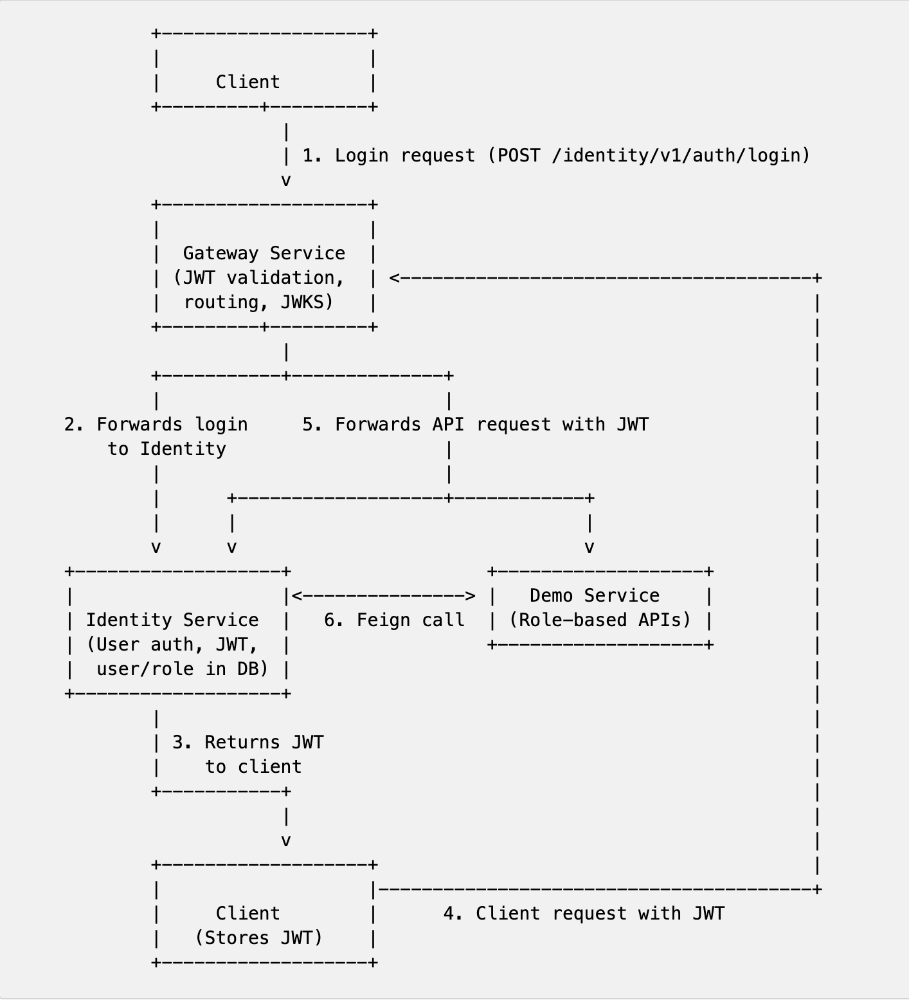

# Spring Boot JWT Microservices Example

This project demonstrates a microservices architecture using Spring Boot, with JWT (JSON Web Token) authentication and role-based access control. It features a MariaDB-backed user and role model, and each service is responsible for a specific domain, following best practices for secure, scalable, and maintainable microservices in Java.

## Project Structure

- **gateway-service/**: API Gateway that routes requests to the appropriate microservices.
- **identity-service/**: Handles user authentication, user info, and JWT token issuance. Manages users and roles in MariaDB.
- **demo-service/**: Example microservice that exposes protected endpoints, accessible only with a valid JWT and proper roles.
- **common-lib/**: Shared library containing common code, utilities, and models used across services.

## Features

- **Spring Boot**: Rapid development with production-ready defaults.
- **JWT Authentication & Role-based Access**: Secure stateless authentication and fine-grained authorization using roles (ADMIN, USER, etc.) embedded in JWT claims.
- **API Gateway**: Centralized entry point for all client requests, with routing and security.
- **Service Isolation**: Each service is independently deployable and scalable.
- **Gradle Multi-Module**: Modular build setup for easy dependency management.
- **MariaDB**: User and role data is stored in MariaDB for persistent authentication and authorization.

## How It Works

1. **User Login**: Users log in through the `gateway-service` (`/identity/v1/auth/login`). The gateway forwards authentication requests to the `identity-service`. Upon successful authentication, a JWT is issued containing the user's roles.
2. **Token Usage**: The client includes the JWT in the `Authorization` header for subsequent requests.
3. **Gateway Validation**: The `gateway-service` validates the JWT and forwards requests to the appropriate microservice. JWKS endpoint is exposed for JWT verification.
4. **Role-based Access**: Endpoints in all services are protected using role-based access. For example, `/users/admin` requires `ADMIN` role, `/users/profile` requires `USER` role, etc.
5. **Database-backed Users/Roles**: User and role data is stored in MariaDB.

<div style="padding-left: 60px">
  
</div>

## Getting Started


### Prerequisites
- Java 17 or higher (for local builds)
- Docker & Docker Compose

### Build the Project

To build all services and Docker images:

```bash
./gradlew clean build -x test
docker-compose build
```

### Run All Services with Docker Compose

Start all services using Docker Compose:

```bash
docker-compose up
```

This will build and run the `gateway-service`, `identity-service`, `demo-service`, and a MariaDB database container. Each service will be available on the following ports:

- Gateway Service: [http://localhost:8080](http://localhost:8080)
- Identity Service: [http://localhost:8081](http://localhost:8081)
- Demo Service: [http://localhost:8082](http://localhost:8082)
- MariaDB: [localhost:3307] (internal port 3306)

To stop the services, press `Ctrl+C` and run:

```bash
docker-compose down
```


### Endpoints Overview

- **Identity Service**
  - `POST /auth/login` — Authenticate and receive JWT (roles included)
  - `GET /users/me` — Get current user info (requires authentication)
  - `GET /users/admin` — Admin-only endpoint (requires ADMIN role)
  - `GET /users/profile` — User-only endpoint (requires USER role)
  - `GET /.well-known/jwks.json` — JWKS endpoint for JWT verification
- **Demo Service**
  - `GET /demo/info` — Private endpoint without role
  - `GET /demo/whoami` — Protected endpoint (requires JWT and USER or ADMIN role) - Feign call to Identity Service
  - `GET /demo/admin/stats` — Admin-only endpoint (requires ADMIN role)
- **Gateway Service**
  - Routes all requests and enforces authentication/authorization


## Configuration

Each service has its own `application.yml` for configuration. Update database, port, and JWT settings as needed.

## Development

You can run services locally for development using Gradle:

```bash
./gradlew :gateway-service:bootRun
./gradlew :identity-service:bootRun
./gradlew :demo-service:bootRun
```
## Testing

Unit and integration tests are provided for authentication, user endpoints, and JWT logic. Run tests with:

```bash
./gradlew test
```

